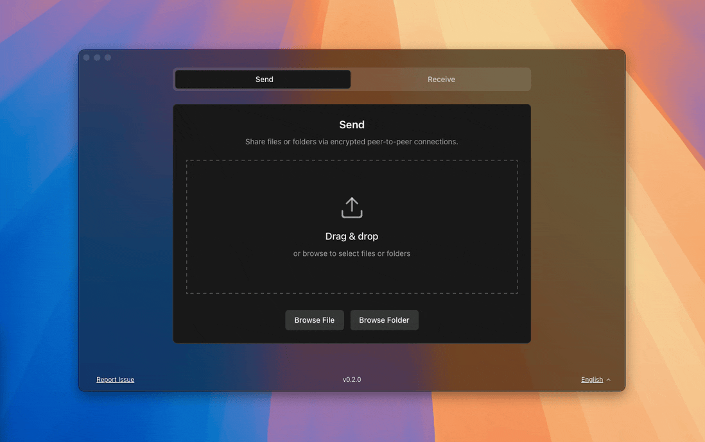

<div align="center">

# AlterSendme

Frictionless peer-to-peer file transfer desktop app built with Tauri + Rust.



<p>
  <a href="https://github.com/bruceblink/alter-sendme/releases/latest"></a>
  <a href="https://github.com/bruceblink/alter-sendme/releases/latest"></a>
  <a href="https://github.com/bruceblink/alter-sendme/stargazers"></a>
  <a href="https://github.com/bruceblink/alter-sendme/network/members"></a>
  <a href="https://github.com/bruceblink/alter-sendme/blob/main/LICENSE"></a>
</p>

<p>
  <a href="https://github.com/bruceblink/alter-sendme/releases/latest"></a>
  <a href="https://github.com/bruceblink/alter-sendme/releases/latest"></a>
  <a href="https://github.com/bruceblink/alter-sendme/releases/latest"></a>
</p>

</div>

AlterSendme is based on [alt-sendme](https://github.com/tonyantony300/alt-sendme), powered by [sendmer](https://crates.io/crates/sendmer), and designed for direct, encrypted file transfer without cloud storage.

## Why AlterSendme

- Direct peer-to-peer transfer (no upload to third-party cloud)
- End-to-end encrypted transport (QUIC + TLS)
- Works on LAN and WAN with NAT traversal + relay fallback
- Supports both files and directories
- No account, no sign-up, minimal friction

## Installation

Download the latest build from [GitHub Releases](https://github.com/bruceblink/alter-sendme/releases/latest).

Direct links for `v0.1.6`:

- Windows: [AlterSendme_0.1.6_x64-setup.exe](https://github.com/bruceblink/alter-sendme/releases/download/v0.1.6/AlterSendme_0.1.6_x64-setup.exe)
- macOS: [AlterSendme_0.1.6_universal.dmg](https://github.com/bruceblink/alter-sendme/releases/download/v0.1.6/AlterSendme_0.1.6_universal.dmg)
- Linux: [AlterSendme_0.1.6_amd64.deb](https://github.com/bruceblink/alter-sendme/releases/download/v0.1.6/AlterSendme_0.1.6_amd64.deb)

## Supported Languages

- Arabic
- Chinese
- Czech
- French
- German
- Italian
- Japanese
- Korean
- Portuguese (Brazilian)
- Russian
- Spanish
- Thai

## Development

### Prerequisites

- Rust `1.88+`
- Node.js `22+`
- `pnpm`

### Setup

```bash
npm install -g pnpm
pnpm install
```

### Run in Development

```bash
pnpm tauri dev
```

### Build

```bash
pnpm build
pnpm tauri build
```

### Validate Locally

```bash
pnpm build
cargo check
```

## Project Roadmap

The optimization plan is kept as our development target:

### Phase 1 (done)

- Removed unused code and dead wrappers
- Improved backend lock scope and state handling
- Tightened Tauri capabilities and CSP
- Improved cross-platform path handling

### Phase 2 (next)

- Reduce frontend bundle size and startup cost
- Improve transfer observability and structured errors
- Add progress/event performance tuning

### Phase 3 (planned)

- Add test matrix (Rust + frontend + smoke E2E)
- Strengthen CI quality gates and release reliability
- Improve auto-update/signing verification workflow

## Security and Privacy

- License: [AGPL-3.0](LICENSE)
- Privacy policy: [PRIVACY.md](PRIVACY.md)

## Contributing

Issues and PRs are welcome. If you want to help, start with bug fixes, UX polishing, or platform-specific testing.

## Acknowledgements

- [Tauri](https://v2.tauri.app)
- [sendmer](https://crates.io/crates/sendmer)
- [iroh](https://www.iroh.computer)

## Support

- [GitHub Sponsors](https://github.com/sponsors/bruceblink)
- [Buy Me a Coffee](https://buymeacoffee.com/bruceblink)

[badge-version]: https://img.shields.io/badge/version-0.1.6-blue
